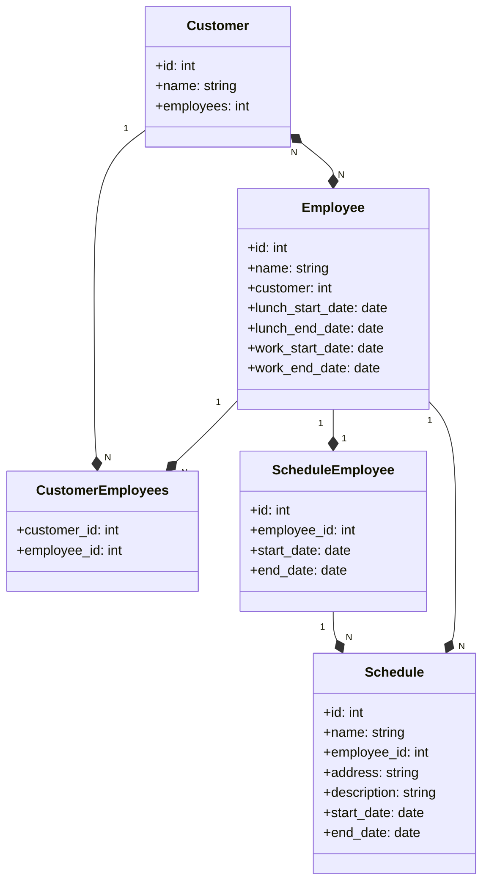

## Diagrama de Classes Barber's Schedule | 1ª Versão

```mermaid
classDiagram
  class Customer {
    +id: int
    +name: string
    +employees: int
  }

  class Employee {
    +id: int
    +name: string
    +customer: int
    +lunch_start_date: date
    +lunch_end_date: date
    +work_start_date: date
    +work_end_date: date
  }

  class Schedule {
    +id: int
    +name: string
    +employee_id: int
    +address: string
    +description: string
    +start_date: date
    +end_date: date
  }

  class CustomerEmployees {
    +customer_id: int
    +employee_id: int
  }

  class ScheduleEmployee {
    +id: int
    +employee_id: int
    +start_date: date
    +end_date: date
  }

  Customer "N" *--* "N" Employee
  Employee "1" --* "1" ScheduleEmployee
  ScheduleEmployee "1" --* "N" Schedule
  Customer "1" --* "N" CustomerEmployees
  Employee "1" --* "N" CustomerEmployees
	Employee "1" --* "N" Schedule
```
